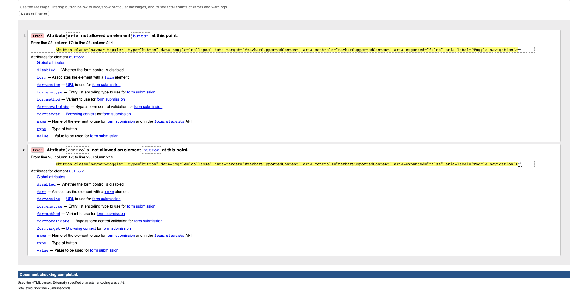
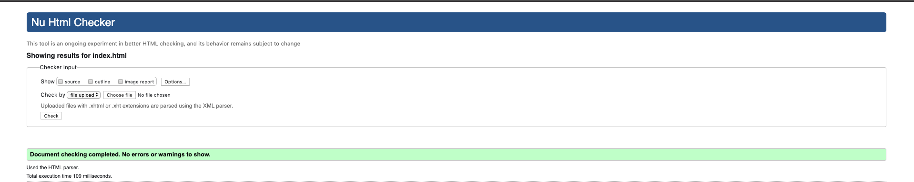
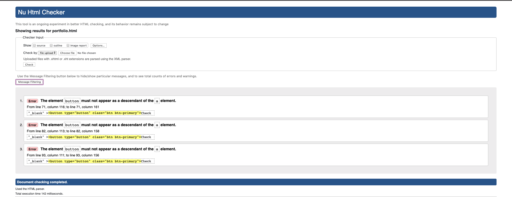
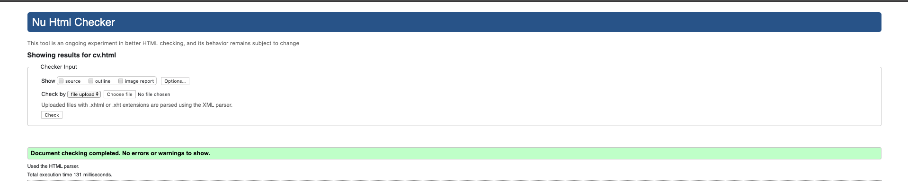
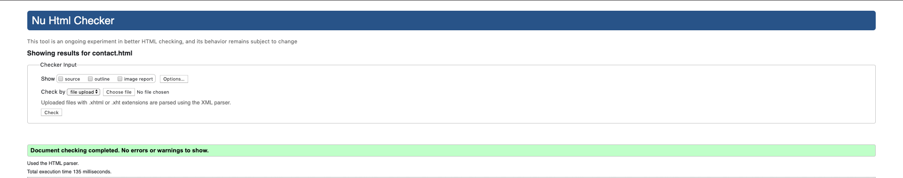
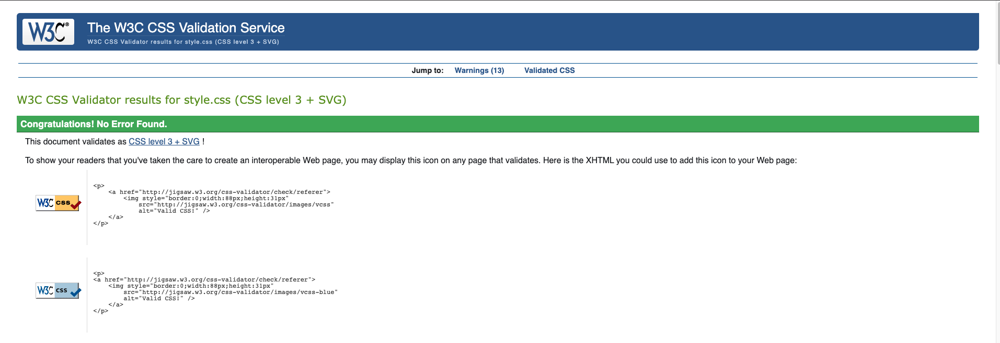

# Assignment2

## Index Validation

### Aria was being used in the header which is agaisnt rules set by W3 to protect the semantics of a page.

### Removed the aria commands and sucessfully validated (Also removed on other pages).

## Portfolio Validation

### Bad practise to have a button inside an anchor or an anchor inside a tag.

### Removed the button and left just the anchor tag to link to the webpages needed (Also removed on other pages).

## CV Validation

### CV page did not have any errors or warnings.

## Contact Validation

### Contact page did not have any errors or warnings.

## CSS Validation

### CSS file did not have any errors or warnings.
